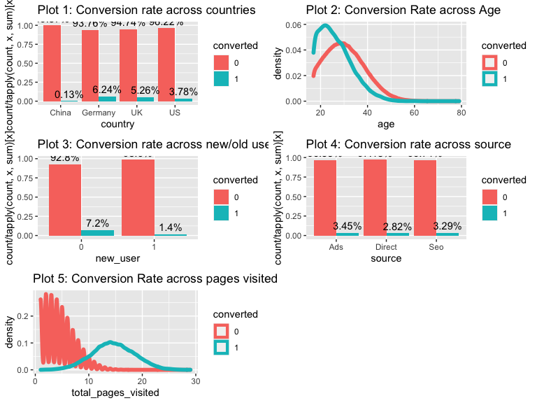
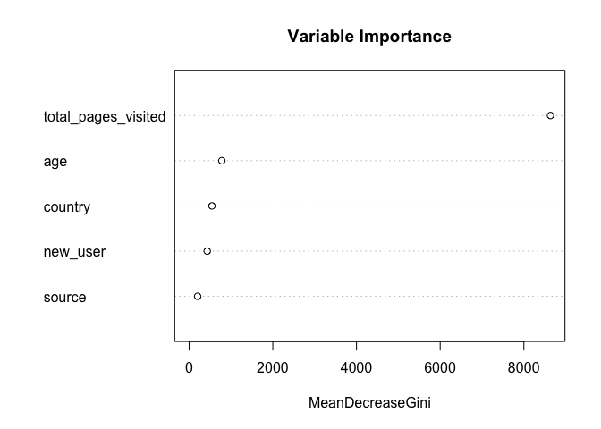
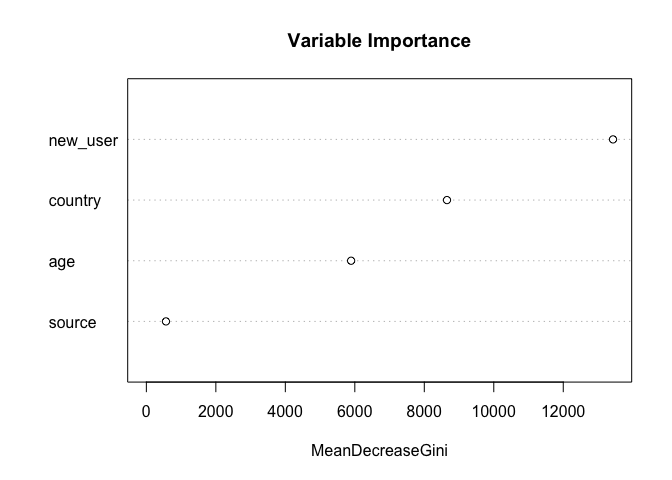
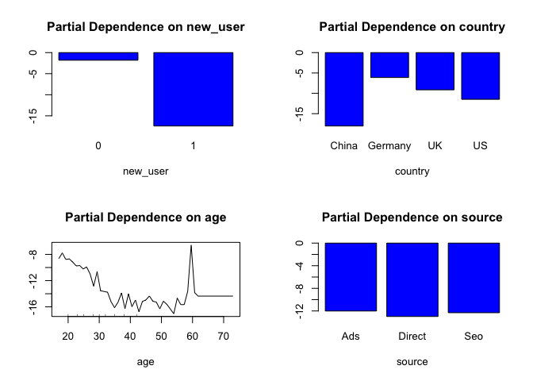

Crack the DS Challenge
================

# Packages

``` r
library(dplyr)
library(ggplot2)
library(caret)
library(randomForest)
```

# Data Wrangling

### Data loading and overview

``` r
# Load the data 
data <- read.csv("https://raw.githubusercontent.com/Saadorj/DataScienceProjects/master/conversion_rate/conversion_data.csv")

# Glance at the data
str(data)
```

    ## 'data.frame':    316200 obs. of  6 variables:
    ##  $ country            : chr  "UK" "US" "US" "China" ...
    ##  $ age                : int  25 23 28 39 30 31 27 23 29 25 ...
    ##  $ new_user           : int  1 1 1 1 1 0 1 0 0 0 ...
    ##  $ source             : chr  "Ads" "Seo" "Seo" "Seo" ...
    ##  $ total_pages_visited: int  1 5 4 5 6 1 4 4 4 2 ...
    ##  $ converted          : int  0 0 0 0 0 0 0 0 0 0 ...

``` r
#check missing values: There are no missing values!
print("Number of missing values in each column")
```

    ## [1] "Number of missing values in each column"

``` r
colSums(is.na(data))
```

    ##             country                 age            new_user              source 
    ##                   0                   0                   0                   0 
    ## total_pages_visited           converted 
    ##                   0                   0

``` r
# Deal with outliers: remove rows with age > 100
data <- data %>% filter(age < 100)


# Deal with data type
data <- data %>% transmute(country = as.factor(country),
                  age = age,
                  new_user = as.factor(new_user),
                  source = as.factor(source),
                  total_pages_visited = total_pages_visited,
                  converted = as.factor(converted))
```

### Check the distribution of each variable

``` r
#character variable
print("levels of character variables")
```

    ## [1] "levels of character variables"

``` r
for (i in c(1,4)) {
  print(unique(data[,i]))
}
```

    ## [1] UK      US      China   Germany
    ## Levels: China Germany UK US
    ## [1] Ads    Seo    Direct
    ## Levels: Ads Direct Seo

``` r
# numberic variable
print("range of numeric variables")
```

    ## [1] "range of numeric variables"

``` r
for (i in c(2,5)){
  print(range(data[,i]))
}
```

    ## [1] 17 79
    ## [1]  1 29

# Exploratory Data Analysis

We dive into the conversion rate in each segment. From the plots below,
we can obtain a number of insights:  
\- **Plot 1**: Among each country, China obvisouly has the lowest
conversion rate, which is followed by US. Otherwise, Germany and UK have
the highest conversion rate.  
\- **Plot 2**: In converted users, most people are around 20-25; for
unconverted users, most people in their 30s.  
\- **Plot 3**: New users are more likely to become converted users.  
\- **Plot 4**: Ads are the biggest source of conversion, which is
following by seo and direct.  
\- **Plot 5**: More pages visited result in higher conversion rate.

``` r
# Conversion rate across countries
p1 <- data %>% ggplot(aes(x=country, fill=converted))+
  geom_bar(aes( y=..count../tapply(..count.., ..x.. ,sum)[..x..]), position="dodge" ) + 
  geom_text(aes( y=..count../tapply(..count.., ..x.. ,sum)[..x..], label=scales::percent(..count../tapply(..count.., ..x.. ,sum)[..x..]) ),
            stat="count", position=position_dodge(0.9), vjust=-0.5) +
  ggtitle("Plot 1: Conversion rate across countries")

# Conversion Rate Across age
p2 <- data %>% ggplot(aes(x=age, color = converted)) + 
      geom_density(size =2) + 
      ggtitle("Plot 2: Conversion Rate across Age") 

# Conversion Rate in New/Old Users
p3 <- data %>% ggplot(aes(x=new_user, fill=converted))+
  geom_bar(aes( y=..count../tapply(..count.., ..x.. ,sum)[..x..]), position="dodge" ) + 
  geom_text(aes( y=..count../tapply(..count.., ..x.. ,sum)[..x..], label=scales::percent(..count../tapply(..count.., ..x.. ,sum)[..x..]) ),
            stat="count", position=position_dodge(0.9), vjust=-0.5) + 
  ggtitle("Plot 3: Conversion rate across new/old users")


# Conversion rate across sources
p4 <- data %>% ggplot(aes(x=source, fill=converted))+
  geom_bar(aes( y=..count../tapply(..count.., ..x.. ,sum)[..x..]), position="dodge" ) + 
  geom_text(aes( y=..count../tapply(..count.., ..x.. ,sum)[..x..], label=scales::percent(..count../tapply(..count.., ..x.. ,sum)[..x..]) ),
            stat="count", position=position_dodge(0.9), vjust=-0.5) + 
  ggtitle("Plot 4: Conversion rate across source")


# Relationship between total_pages_visited and converted rate 
p5 <- data %>% ggplot(aes(x=total_pages_visited, color = converted)) + 
      geom_density(size =2) + 
      ggtitle("Plot 5: Conversion Rate across pages visited") 


gridExtra::grid.arrange(ggplotGrob(p1),ggplotGrob(p2),ggplotGrob(p3),ggplotGrob(p4),ggplotGrob(p5),ncol=2)
```

<!-- -->

# Machine Learning

### Splitting train and test set

``` r
index <- createDataPartition(data$converted, p = 0.75, list = FALSE)
train_data <- data[index, ]
test_data  <- data[-index, ]
```

### Fit a random forest model

  - I am going to pick a **random forest model** because it has the
    following advantages:
      - It took very little time to optimize, and its default parameters
        are often closed to the best ones.  
      - The random forest model is strong with outliers, irrelevant
        variables, and it’s insensitive to variable types.
  - I will implement the procedure of modeling in the following steps:
    1.  Fit a random forest model on the training data and make
        predictiom on the test data.  
    2.  Create partial dependence plots and rank the importance of
        variables  
    3.  Build a simple tree to find the most obvious user segments to
        see if they agree with the random forest partial dependence
        plots.
  - Explanation of model parameters:
      - `ntree = 100`: 100 tress  
      - `mtry = 3`: 3 random variables selected at each split

<!-- end list -->

``` r
# Fit a random forest model on the training data. 
rf <- randomForest(y = train_data$converted,
                   x = train_data[,-ncol(train_data)],
                   ytest = test_data$converted,
                   xtest = test_data[,-ncol(train_data)],
                   ntree = 100,
                   mtry = 3,
                   keep.forest = TRUE)

# Summary of the model 
rf
```

    ## 
    ## Call:
    ##  randomForest(x = train_data[, -ncol(train_data)], y = train_data$converted,      xtest = test_data[, -ncol(train_data)], ytest = test_data$converted,      ntree = 100, mtry = 3, keep.forest = TRUE) 
    ##                Type of random forest: classification
    ##                      Number of trees: 100
    ## No. of variables tried at each split: 3
    ## 
    ##         OOB estimate of  error rate: 1.46%
    ## Confusion matrix:
    ##        0    1 class.error
    ## 0 228583  917 0.003995643
    ## 1   2552 5097 0.333638384
    ##                 Test set error rate: 1.42%
    ## Confusion matrix:
    ##       0    1 class.error
    ## 0 76204  296 0.003869281
    ## 1   825 1724 0.323656336

We can observe that the out-of-bag (OOB) error(1.43%) is similar to the
test error(1.45%), which reveals that we are not overfitting. We have
reached a very good accuracy: 98.5%. We will continue to check the
partial dependence plots and variable importance.

### Rank the importance of each variables

In this case, `total_pages_visited` is the most important variable. It
is understandable that people visit more pages because they already have
the desire to purchase. In other words, people have to click on more
pages in order to buy things.

``` r
varImpPlot(rf, type = 2, main = "Variable Importance")
```

<!-- -->

### Rebuild the random forest model

We can try to rebuild the model by dropping the `total_pages_visited`.
Since we dropped a very powerful predictor, and our data is imbalanced,
we adjust the classweight to ensure the prediction won’t always fall in
the majority class.

``` r
#Build a new random forest model without the predictor 'total_pages_visited'
rf_drop = randomForest(y=train_data$converted, 
                  x = train_data[, -c(5, ncol(train_data))],
                  ytest = test_data$converted, 
                  xtest = test_data[, -c(5, ncol(train_data))],
                  ntree = 100, 
                  mtry = 3, 
                  keep.forest = TRUE, 
                  classwt = c(0.7,0.3))

# Summary of the new rf model
rf_drop
```

    ## 
    ## Call:
    ##  randomForest(x = train_data[, -c(5, ncol(train_data))], y = train_data$converted,      xtest = test_data[, -c(5, ncol(train_data))], ytest = test_data$converted,      ntree = 100, mtry = 3, classwt = c(0.7, 0.3), keep.forest = TRUE) 
    ##                Type of random forest: classification
    ##                      Number of trees: 100
    ## No. of variables tried at each split: 3
    ## 
    ##         OOB estimate of  error rate: 14.15%
    ## Confusion matrix:
    ##        0     1 class.error
    ## 0 199399 30101   0.1311590
    ## 1   3454  4195   0.4515623
    ##                 Test set error rate: 13.88%
    ## Confusion matrix:
    ##       0    1 class.error
    ## 0 66690 9810   0.1282353
    ## 1  1163 1386   0.4562574

From the summary the accuracy drops a little bit, but the model is still
good enough. Let’s check the variable importance again.

### Check the variable importance

``` r
varImpPlot(rf_drop, type = 2, main = "Variable Importance")
```

<!-- -->
An interesting phenomenon occur: now `new_user` is the most important
variable, which is followed by country and age. Source is the least
important variable. Among these four predictors, let’s check their
partial dependence:

### Partial dependence plots

``` r
par(mfrow = c(2,2))

partialPlot(rf_drop, train_data, new_user, 1)
partialPlot(rf_drop, train_data, country, 1)
partialPlot(rf_drop, train_data, age, 1)
partialPlot(rf_drop, train_data, source, 1)
```

<!-- -->

From these partial dependence plots, we can observe that:  
1\. Old users are better than new users.  
2\. Chinese users are least likely to convert, while Germany users are
the most likely to convert.  
3\. Younger users are more likely convert than older users.  
4\. There isn’t significance difference among various sources in terms
of conversion.
